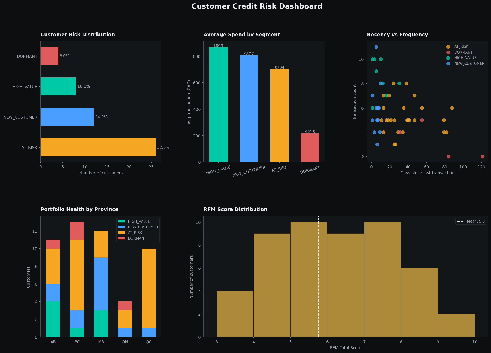

# Customer Credit Risk Dashboard

A Python-based executive dashboard that reads customer RFM segmentation data and produces five business-driven charts answering the questions a risk manager, branch director, or product team at a retail bank would ask before making retention and campaign decisions.



---

## The Problem This Solves

A database full of RFM scores is not useful until someone can read it. This dashboard translates the segmentation output from the customer analysis pipeline into a single-page visual report — designed for speed, not decoration. Every chart earns its place by answering a specific question. No chart exists just to look impressive.

---

## Connected Data Pipeline

This is the third stage of a connected banking data portfolio:

```
Week 5 — Transaction ETL          Week 6 — Customer Segmentation      Week 7 — This Dashboard
transactions_clean.db        →    segmentation.db                →    credit_risk_dashboard.png
490 clean transactions             50 accounts, 4 segments               5 charts, executive summary
```

The dashboard reads directly from `../02-customer-segmentation/data/segmentation.db` — no new data generation required.

---

## Five Charts — Five Business Questions

**1. Customer Risk Distribution**
*How concentrated is our credit risk exposure?*
A horizontal bar chart showing customer count and percentage per segment. A portfolio where AT_RISK exceeds 40% is flagged automatically in the terminal output — that threshold signals a retention crisis requiring executive attention.

**2. Average Spend by Segment**
*Which segments generate the most revenue — and what does churn actually cost?*
HIGH_VALUE customers average $869 per transaction versus $216 for DORMANT. This gap quantifies the financial consequence of losing a customer before they churn, making the case for proactive retention spend.

**3. Recency vs Frequency Scatter**
*Which AT_RISK customers can still be saved?*
Customers in the top-left of the scatter (high frequency, low recency days) are still transacting and represent the last viable re-engagement window. Customers in the bottom-right have already effectively churned.

**4. Portfolio Health by Province**
*Where should regional campaigns focus?*
A stacked bar chart showing segment composition by province. A province dominated by DORMANT or AT_RISK customers may need localised pricing reviews, product adjustments, or targeted outreach — not a national campaign.

**5. RFM Score Distribution**
*Is our customer base trending healthy or deteriorating?*
A histogram of total RFM scores with the portfolio mean marked. This portfolio peaks at score 5–6 with a mean of 5.8. A healthy retail banking portfolio typically peaks at 7–8. The left skew signals deteriorating engagement that warrants a strategic review.

---

## Portfolio Health Summary — Terminal Output

Before rendering the dashboard, the pipeline prints an instant text summary:

```
==================================================
PORTFOLIO HEALTH SUMMARY
==================================================
Total customers      : 50
High-value customers : 8
At-risk customers    : 26
Dormant customers    : 4
Avg transaction spend: $XXX.XX
AT_RISK as % of portfolio: 52.0%
⚠ WARNING: AT_RISK exceeds 40% threshold
```

This gives a risk manager an actionable snapshot before opening the chart file.

---

## What Would Be Added in Production

- **Automated weekly refresh** — re-run the dashboard each Monday as new transactions are loaded, with results emailed to the risk committee
- **Period-over-period comparison** — track whether the AT_RISK percentage is growing or shrinking week on week
- **Drill-down by account type** — separate views for CHEQUING, SAVINGS, and BUSINESS accounts, which have different churn risk profiles
- **Power BI integration** — connect the same SQLite database to a live Power BI report for interactive filtering by province, account type, and date range

---

## How to Run

python dashboard.py


Output saved to `data/credit_risk_dashboard.png`

---

## Tools

Python · Pandas · Matplotlib · NumPy · SQLite